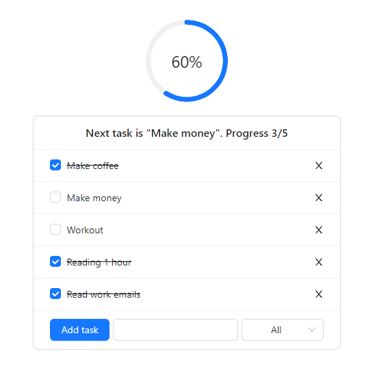

## Simple ToDo Web App
This is a simple ToDo app. It was created with combination __React__/__MobX__ and styled with __AntDesign__.

ToDo component maintain functionality (respecting [requirements](https://drive.google.com/file/d/17i3HWkCW8OdvmczEcE2p3q-ljU-2sAWz/view)):
1. Adding new task.
2. New task can be added only if its length less or equal to `N` (in this case `N = 15`).
3. Listing added tasks.
4. Deleting task.
5. Switching task state `Finished / Unfinished` after click on it.
6. Filtering by type `All / Finished / Current`.
7. Displaying counter of completed tasks.
8. Using storage, Redux or <u>MobX</u>.

## This is how it looks like:

## Go Ahead And Try It By Yourself

This project was bootstrapped with [Create React App](https://github.com/facebook/create-react-app).

To clone repository, use:

### `git clone https://gitlab.com/bipkey/todo-with-mobx.git`

After that, in the project directory, you can run:

### `npm start`

Runs the app in the development mode.
Open [localhost:3000](http://localhost:3000) to view it in your browser.

---

Also, this project has its [Docker Image](https://docs.docker.com/get-started/overview/#images).
To load the image please use:
### `docker pull registry.gitlab.com/bipkey/todo-with-mobx`
Then, create a docker container by running:
### `docker run -d -p 80:80 registry.gitlab.com/bipkey/todo-with-mobx`

Open [localhost](http://localhost/) to view it in your browser.

---

Also, app hosted on vercel, visit [todo-with-mobx.vercel.app](https://todo-with-mobx.vercel.app/). :)
